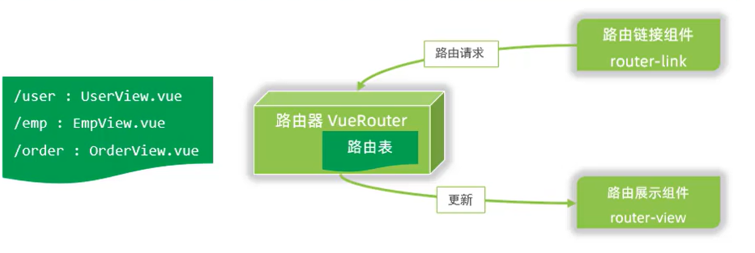
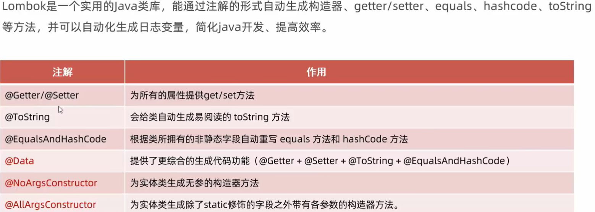
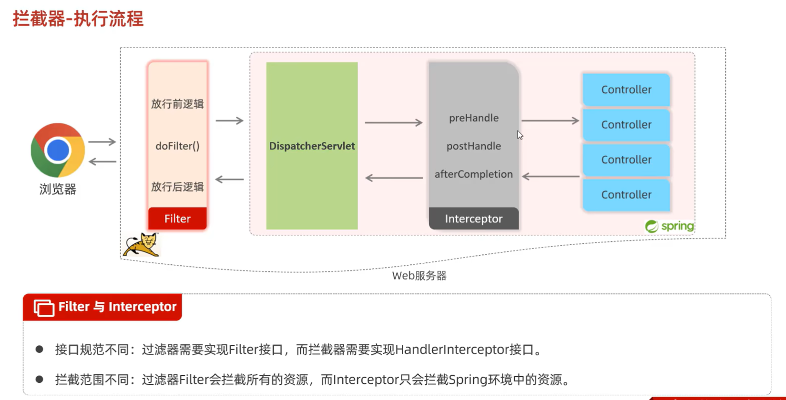

# JavaWeb_learn
记录本人JavaWeb学习过程

Web前端结构: HTML(结构)+CSS(表现)+JS(动作与交互)

1.HTML：超文本标记语言。
	
	-标签不区分大小写
	-属性值可用单引号和双引号
	-语法较为松散

img中src路径分为绝对路径/相对路径

	-绝对路径: 绝对磁盘路径/绝对网络路径(需要联网)。
	-相对路径: 相对于当前文件夹路径。
	
2.CSS引入方式:
	
	1.行内引入。只控制单个标签。
	2.内嵌引入。只控制本文件中标签，一般定义在head标签中。
	3.外联引入。在外部css文件中定义样式，由link引入。
	
在标签中可以添加id、class来分类标签，一般id值唯一，而class可以相同。

通过使用不同的选择器，指定修改的标签。优先级:id选择器 > 类选择器 > 元素选择器
	
	元素选择器: 元素{   }
	类选择器: .类名{   }
	id选择器: #id值{   }	
	
超链接:；可以通过css设置超链接样式。	

3.盒子模型:将页面内元素看成一个盒子，更好操作。相关标签
\

相关内容: content-padding-border-> margin外边距，不属于盒子。

	样式设计:
	        div {
            width: 200px; //盒子宽度
            height: 200px; //盒子高度
            box-sizing: border-box; //上述宽高作用的范围，当前是对border级别生效

            padding: 20px;//设置盒子的内边距区域
            border: 50px solid gold; //设置盒子的边框
            margin: 30px;  //设置外边界区域(盒子外部区域的上右下左)

        }
	
4.表格标签:

	<table border:表格边框  cellspacing:单元格的间隔  width:表格宽度> 
		<tr>//表行
			<th>表头单元格</th>
			
			<td>普通单元格</td>
			......
		</tr>
	</table>	
	
	
5.表单标签: form

	属性: action="数据提交到的URL"
	      method="提交数据的方式"
			get: 将表单数据接在url后，这样提交的数据长度(大小)有限制
			post: 将数据提交到post报文中，可以携带的数据量较大。
	
	表单项:
		input ：可以是输入框、单选、多选、时间列表、电子邮件、数字等等
			type: 控制输入的类型，如果是submit就会触发method提交数据
			name: 如果想要提交该项的内容，必须有name属性，用于标记返回的数据键值对：name1=value1&name2=value2
			value: 显示/提交的值	
		
		select:下拉列表
		textarea:文本域
	
6.JS：跨平台、面向对象的脚本语言；
脚本语言:不需要编译，由浏览器(解释器)直接解释。
	
	三种输出语句:
		    <!-- 方式1：弹窗警告 -->
    
    
    <!-- 方式2：输出在html页面 -->
     

    <!-- 方式3：输出在浏览器控制台 -->
     
	
变量:类似python，对变量赋值类型不做限制

		-var：作用域大，相当于全局变量，定义的变量可以跨{ }使用；并且var可以重复定义同名变量。
		-let：作用域小，类似于局部变量，无法跨{ }使用；
		-const：定义常量，该变量只能赋值一次，无法跨{ }使用。
	
	数据类型
		原始类型:number、string、boolean、null(空对象)、undefined(未初始化)；
		引用类型:对象
	
运算符:特殊的: ===：严格相等

	==：比较时先判断数据类型，类型不同则转换成相同的，然后再比较值。
	===:严格相等，当数据类型不同时直接返回false
	
类型转换:
	
	string->number: parseInt(s)/parseFloat(s)：返回s前面字符符合要求的数字，如果一位都没有，返回NaN
	其他类型-> boolean：0、NaN、空字符串""、null、undefined为false，其他为true
	
函数:
	
	定义方式:
		1.function functionName(参数1,参数2,......){
			函数体
		}
		
		2.var functionName = function(参数1,参数2,......){
			函数体
		}
		
		调用方式相同: functionName(参数1......)
		调用时传参可以传入不定参数，方法只会接收自己需要的前N个参数。
	
数组:类似Java中的集合，但比集合的限制更少
		
	1.长度可变。
	2.可以定义任意索引处的值，中间被跳过的索引处值为undefined。
	
	方法:forEach(方法):遍历有值的元素。
		 push(......)向数组末尾处添加元素。
		 splice(start, number)从指定索引处开始，删除number个元素。

箭头函数: (参数) => {方法体}	
	
字符串:与Java中类似。
		
	trim():去除开头与结尾的空格。
	s.indexOf("str"):该str在s中出现的首位索引。
	substring()、charAt()......
	
自定义对象:
	
	var user ={
            name: "Tom",
            age: 23,
            gender: "male",

			/*
			eat: function(){
                alert(user.name+"吃饭")
            } 
			*/
           eat(){
            alert(user.name+"正在吃饭")
           }
        }
		
        alert(user.name)
        user.eat()

JSON:本质上是一个字符串，格式与自定义对象类似，但key要使用双引号，最外层要使用单引号。
	
	var myJSON='{ "name": xxx, ......}'
	
	JSON.parse(JSON): 将json转换为对象；
	
	JSON.stringify(obj): 将对象转换为JSON；
	如果对象中有方法，则忽略方法。
	

BOM: 浏览器对象模型，由当前浏览器页面组成
    
    window对象:当前浏览器窗口对象。
        -属性history，location，navigator
        -方法
            1.alert:确认弹窗
            2.confirm:选择弹窗,返回false/true
            3.setInterval: 按照指定周期来调用函数
            4.setTimeout: 在指定毫秒数后调用某个函数。
        location：当前页面的导航栏
            location.href：获取/设置当前当前页面的url
            href=href，页面会进行跳转

DOM: 文件对象模型，将整个html页面视为document，标签为element
    
    1.每个标签有自己的属性和内容
    2.通过window.document.getBy[id | className | name | elementName]可以获取想要的标签
    3.对标签中的属性、内容进行处理。

事件监听: 给元素绑定一个事件，当事件触发是会执行相应的操作。

    绑定操作:
        1.在标签内部使用 事件名="函数名()"；
        2.在script中获取标签(元素)，通过元素.事件名= function(){
                                                        函数体
                                                        }
        
常见的事件:

	
Vue框架: view-model-viewmodel模型。
	
	1.需要先导入vue.js
	2.在script中创建Vue对象，
	  指定
		el:"#id", 该Vue对象实际控制的区域
		data: {......}, 该Vue的数据模型
		methods: { ...... }, 该Vue的函数模型
	3. 插值表达式：{{ }}
	4.可以使用this.name来调用该Vue的data中的name数据。
		
常用指令:
	
	v-bind:属性="data"(:属性="data"); 绑定标签的属性如href\css样式，这样就可以使用Vue中data部分的属性作为属性值，从而达到动态修改。
	v-model="data"; 在表单/input等上创建双向绑定，表单上被修改的数据实时映射到Vue的data对应数据中。
	v-on:事件="method"(@事件="method"); 为这个标签绑定事件。 
	
	v-if-else-if="condition":判断为true,则会在页面上渲染，否则不渲染。
	v-show="condition": 无论判断是否为true都会渲染，通过display来控制是否展示。
	v-for="(item, index) in items"; items为data中的数组，item为临时变量，index可有可无，为索引。
	
	
Vue的生命周期:一共有八个阶段，每个生命周期都有其对应的自动执行的生命周期方法(钩子方法)

	生命周期方法与methods、data平级，在Vue到达相应的生命周期阶段时自动执行
	
7.Ajox-Axios：异步请求
	
	由于原生Ajox的繁琐性，已经被逐步淘汰，可以使用其封装类来简化操作
	-Axios: 需要导包
		完整写法:
			function name(){
			axios({
				method:"",
				url:""
				[data:"",]
				[confing:"",]
				
				//回调函数，用于处理得到的数据。result为返回的数据
			}).then(result =>{方法体})
			}
		简化写法:
		function name(){
			axios.get/delete/post/put(url [,data [,config]]).then(result => {方法体})   
		}  

前后端分离: 需求分析->API接口文档->并行开发->分离测试->联调测试	

8.使用Vue工程化开发。

创建的Vue项目具有热部署的性质: 修改的内容实时映射到浏览器页面上，不需要刷新页面。	

		1.配置NodeJS环境，导入vue/cli脚手架。
		2.创建vue项目(使用命令行/图像UI)
		3.在VSCode中导入创建好的Vue项目:
			node_modules: 项目依赖包
			public: 项目静态文件
			src: 项目源码
			package.json: 模型基本信息，项目模块，版本信息
			vue.config.js: vue配置
			......
		4.启动Vue项目

.vue文件:组件文件:
		 
	-template：模板，编写HTML代码。
	-style：控制CSS样式。
	-script：控制模板的数据来源与行为。
		使用export default{
				data: function(){
				return{
					message:"要返回的数据"
					}
				},
				method: {
				 方法
				}
			
			}

自己编写组件时要按照:PascalCase/kebab-case来命名，这样Vue才能正确识别并转换: ElementView->element-view	
自己编写的vue组件需要在根组件(APP.vue)中使用:<element-view></element-view>导入

9.完整创建一个Vue项目:
	
	1.在main.js中导入ElementUI组件
	2.在src/views中创建自己的组件。
	3.在src/router/index.js为自己创建的组件配置路由:
		{
			path: '/dept', //http://localhost:7000/#/dept; #:URL的哈希
			name: 'dept',  //该路由的名字
			component: () => import( '../views/tlias/EmpView.vue') //展示的组件
		}
		  
		{	//配置默认路由
			path: '/',   //当打开页面时展示根地址
			redirect: "/dept"  //将根地址重路由到上面定义过的某个地址
		}
	4.将根组件(APP.vue)中展示的内容改为:<router-view></router-view>;//根据路由地址展示页面
	5.为某个组件配置跳转超链接: <router-link to="/dept">xxxx</router-link>; 此时点击xxxx就会跳转到配置好的/dept组件。
	6.打包和部署:点击build打包当前vue项目到dist文件夹中，导入nginx的http文件夹中，运行nginx，在浏览器输入http://localhost:prot即可访问。
	
Vue路由:

10.Maven：管理和构建Java项目的工具。

Maven坐标:
	
	-groupId: 当前Maven项目隶属的组织名称
	-artifactId: 当前Maven项目名称
	-version: 当前项目的版本号
	
依赖管理(Maven核心)：

	1.依赖配置：引入依赖

		1.在pom文件中编写:<dependencies>标签，在这个标签中导入依赖；
		2.编写<dependency>标签，每个<dependency>都单独管理一个依赖；
		3.定义坐标的groupId、artifactlId、version；
		4.点击刷新，引入最新加入的坐标。
		
		<dependencies>
			<dependency>
				<groupId>ch.qos.logback</groupId>
				<artifactId>logback-classic</artifactId>
				<version>1.2.12</version>
			</dependency>
			......
		</dependencies>
		
	2.依赖传递: 直接依赖与间接依赖
		
		projectA引入依赖projectB时，会将B所依赖的配置projectC一起导入，此时A也依赖C，A对C是间接依赖，对B是直接依赖。
		如果不想引入C，此时需要排除依赖: exclusions
			1.找到引入projectB的<dependency>。
			2.在标签内部添加：
				<exclusions>
					<exclusion>
						<groupId></groupId>
						<artifactId><artifactId>
						//不需要指定版本号
					</exclusion>
					......
				</exclusions>

	3.依赖范围: 引入的依赖可以生效的范围:main文件夹内、test文件夹内、是否参与打包

			-在引入配置时添加<scope>compile(默认值)/test/provided/runtime</scope>标签设置该依赖的作用范围。

	4.生命周期: maven有3套不同的生命周期，每个生命周期都有自己的阶段。

		-clean:清理工作。
		 default: 核心工作,包括编译、测试、打包、安装(将当前Maven.jar安装到本地仓库)等。
		 site: 生成报告、发布站点等。
		
		※1.在同一套生命周期中执行后面的阶段时，前面的阶段会自动执行，而且是先执行。
		 2.在IDEA中使用Maven执行相应的生命周期指令(在控制台执行Maven指令同理)时，实际上调用的是相应绑定的插件。
	
11.SpringBoot	
	
	-controller:请求处理类: @RestController标识
	
	-绑定请求路径与请求方法: @RequestMapping(path); 绑定路径与方法
	
HTTP数据格式:

	-请求数据格式：
		-请求行: 请求方式、请求路径、协议。
		-请求头: 资源信息，以键值对key: value 形式传递。
		-请求体: POST发起请求时，存放请求参数。
		
	-响应数据格式:
		-响应行: 协议版本、状态码(200\404\500最为常见)、描述
		-响应头: 资源信息，以键值对key：value 形式传递。
		-响应体: 存放响应的数据。
		
Web服务器(一个软件程序)：对HTTP协议的封装，可以处理和响应客户端发来的请求，使得后端不需要在重复定义服务器类。	

著名的Web服务器:Tomcat：轻量级Web服务器，支持Servlet/JSP等少量的JavaEE规范

SpringBoot的起步依赖内嵌了Tomcat服务器

12.使用sprintboot接收请求参数
		
	1.简单参数:
		-在对应的方法中添加与参数同名的变量即可接收，并且进行自动的类型转换。
			GET方法:{
			http://localhost:8080/simplePara?name=Tom&age=23
			
			@RequestMapping("/simplePara")
			public String getPare(String name, int age)
			}
			
			POST方法{
			在请求体中使用键值对传递参数
			
			@RequestMapping("/simplePara")
			public String getPare(String name, int age)
			}
		当传递参数与形参名不一致，可以使用@RequestParam映射
		public String getPare(@RequestParam("name", required = false) String username, Integer age)
			-将"name"映射到username上，同时修改required的值为false: 该"user"参数可以不传递。
	
	
	2.实体参数:使用对象接收参数(以User user为例)
		1.无嵌套关系接收:对象的成员变量与请求参数名一一对应即可。
		2.嵌套参数接收:如address.province\address.city
			-在User类中添加Address类变量address。
			-创建Address类并添加province和city两个参数
			
	3.数组参数:使用数组/集合接收请求参数
		当传递的请求参数中包含一个key对应多个value时，可以使用同名数组/集合接收
		{
		public String getArray(String[] hobby)
		或者
		public String getArray(@RequestParam List<String> hobby):使用集合接收时@RequestParam(绑定参数关系)是必须的！
		}
	
	4.时间参数:请求参数为某个格式的时间
		public String getTime(@DateTimeFormat(pattern = "yyyy-MM-dd HH:mm:ss") LocalDateTime newTime)
			@DateTimeFormat(pattern = "指定时间格式，只能接收这个格式的时间参数")。
			newTime：与请求参数同名。
	
	5.JSON参数:请求体为JSON数据，使用POJO实体参数接收
		public String getJSON(@RequestBody User user)
			@RequestBody:将JSON的数据封装到User中
			User中的成员变量要与JSON中Key同名，具体要求与实体参数相同。

	6.路径参数:参数是路径的一部分。
		@RequestMapping("/path/{id}/{name}")
		public String getPath(@PathVariable Integer id, @PathVariable String name)
			1.输入的参数必须满足....../path/id/name才会被映射到getPath方法。
			2.{id}/{name}都是可变参数，可以随着请求路径的改变而改变。
			3.@PathVariable:将路径参数与方法形参绑定，必须同名。

响应注解:ResponseBody: 作用在Controller类/方法上，将返回值作为响应数据返回给请求端。
		
	@RestController = @Controller + @ResponseBody
	返回结果：String -> String
			  对象/数组/集合 -> JSON格式

统一响应结果:将要返回的信息封装到同一个类中，统一返回该类对象。

	public class Result {
		private int code;
		private String msg;
		private Object data;
		......
		
		public static Result success/error(){
		return new Result(code,msg,data);
		}
	}
	
	
员工数据案例

	前端:定义整个HTML界面，使用Vue组件定义mounted方法，在页面挂件加载完成后触发axios，传递listEmp访问路径
		mounted(){
            axios.get('/listEmp').then(res=>{
                if(res.data.code){
                    this.tableData = res.data.data;
                }
            });
        },
	
	后端: 在请求处理类中定义方法接收前端的请求
		@RequestMapping("/listEmp")
		public Result getEmp(){
		 ......
		 return Result.success(list)
		}
	
13.SpringBoot的项目的单一职责原则

    三层架构: 将后端接收-响应分为三层处理
		
		1.Controller: 控制层。负责接收数据、响应数据。
		2.Service: 业务逻辑层。负责处理具体的业务逻辑。
		3.Dao: 数据访问层。负责对数据进行访问操作(包括curd)。
	
	分层解耦：高内聚低耦合
		IOC：控制反转，对象的创建权由程序自身 -> 外部容器(IOC容器)
		DI: 依赖注入，IOC容器根据自己管理的类自动为程序创建合适的类对象，
		Bean对象: 交给IOC容器管理的类。
		
		实现:@Component和@Autowired
	
			-@Component：标记类，表示将这个类交给IOC容器管理。
				衍生: 以下三个注解都可以声明一个Bean
				1.@Controller 声明控制器对象。在spring boot集成Web开发中，只能用@Controller声明控制器。
				2.@Service 声明Service对象
				3.@Repository 声明Dao对象
			细节:	
				1.@Component("xxx")可以指定Bean对象名，默认为: 类名首字母小写: ServiceB -> serviceB
				2.需要扫描才能生效: @ComponentScan：对范围内的@Component进行扫描，并将其加入IOC容器中。默认范围：当前类包及其子包。
				3.启动类的@SpringBootApplication已经包含@ComponentScan，可以扫描启动类所在包以及子包。
				4.手动添加(破环默认范围)@ComponentScan({"path1", "path2, ......})
					
			-Autowired: 标记对象，当程序运行时自动在容器中选择合适的类创建对象，并赋值。
				@Autowired
				Service service //= new ServiceImplB;
				自动创建的类对象甚至会覆盖原程序中定义的类对象(ServiceImplB)
			细节：
				1.当IOC容器中存在多个符合条件的Bean对象会报错。
				2.使用如下三种注解来解决：
					-@Primary: 注解冲突类的某一个，表示使用该类。
					-@Qualifier("Bean对象名"): 与@Autowired一起使用，表示使用该类Bean对象。
					-@Resource(name="Bean对象名"): 单独使用，不需要@Autowired，表示使用该类Bean对象。
				经过测试:优先级 @Resource>@Qualifier>@Primary			
					
				@Qualifier与@Resource区别:
					1.前者spring框架提供的注解，后者是JDK提供的注解。
					2.前者默认是按照类型注入，后者默认是按照名称注入。
					
14.SQL数据库
	
	建表字段约束:	非空约束	唯一约束	主键约束	 默认约束	 外键约束
					not null     unique	   primary key   default    foreign key
		
	数据类型:大致分三类: 
		数值类型：主要使用: tinyint\int\double （double(n,m):一共n位，有m位小数）
		
		字符串类型：主要使用: char(n),varchar(n)
			char(n):定长字符串,无论存入的值是多少(<n)，都占据n个字节。
			varchar(n):变长字符串，根据存入的字符串大小(<n)分配内存空间。
			
		日期类型：主要使用: date:日期/ datetime: 日期+时间
		
	修改表结构: alter table 表名 对应操作; 	
		
	对表中数据进行CURD：
		添加数据: insert into table_name(...... ) values(...... )
			-字符串和日期类型需要使用单引号引起来。
			-values中的值要与table_name()中的字段一一对应。
		
		修改(更新)数据: update table_name set column1=value1 [, column2 = value2......] [where 条件];
			-不设置条件的话会修改整张表的该字段的值。
		
		删除数据: delete from table_name [where 条件];
		-如果不指定条件，删除整个表中数据。
		
		查询数据: select column [as 别名] from table_name [where [group by [having [ order by[ limit]]]]]
			条件查询:
				比较特殊的符号:between...and... \ like '_%' \ in(......) \ is null \ and与&& \ or与|| \ not与! \ !=与<>
			
		聚合函数:
			使用:函数名(字段名)。
			聚合函数会忽略值为null的字段。
			
		分组:group by
			-分组后查询数据显示的字段值只有 分组字段 和 聚合函数 才有意义。
		
		where与having的区别
			-执行时机: where在分组前执行，having在分组后执行。
			-对聚合函数判断: where不可对聚合函数进行条件判断，having可以使用聚合函数进行条件判断。
		
		排序查询: order by 字段1 排序方式1, 字段2 排序方式2......
			-排序方式: asc 默认，升序； desc 降序。
			-按照字段顺序规定优先级：左 -> 右
	
		分页查询: limit 起始索引, 每页展示记录数。
		
		流程控制语句:
			if(条件, true:值1, false:值2) [as 字段别名]	
				-select if(gender=1, '男性员工', '女性员工') 性别, count(*) 人数 from tb_emp group by gender;
			
			case 表达式 when 值1 then 结果1 [when 值2 then 结果2......] [else result]/*所有值都不匹配，返回result*/ end
				case开始，end结尾。
				-select (case job
					when '1' then '班主任'
					when '2' then '讲师'
					when '3' then '教研主管'
					when '4' then '学工主管'
					else '无职位分配' end
					)  职位, count(*)
				from tb_emp
				group by job;
	
15.多表设计
	
	一(父表/主表)对多(子表): 使用物理外键(使用SQL语句生成实际的外键绑定双表关系)缺点较大，建议使用逻辑外键:在业务处理层面通过代码来保证数据的一致性和完整性。
	
	一对一:任意一张表使用外键关联另一张表保证数据的一致性和完整性，并且为了保证一对一关系，可以给外键字段添加unique约束。
	
	多对多: 使用中间表以及两个外键字段分别关联两张表的主键。
	
16.	多表联查

	内连接:查询交集部分
		-隐式内连接: from t1 , t2 where
		-显示内连接: from t1 [inner] join t2 on 条件
	
	外连接:查询交集部分以及左/右表所有数据
		-左外连接: from t1 left [outer] join t2 on 条件
		-右外连接: from t1 right [outer] join t2 on 条件
		！外连接要配合where使用: ON判断后无论左/右表是否符合条件都会返回全部内容，此时要使用WHERE来进一步筛选。
	
	子查询:按照查询返回结果可以分为四类
		-标量子查询:返回的结果是单个值，可以作为条件判断的值。
		-列子查询:返回的结果是单列(可以多行)，配合in\not in来使用。
		-行子查询:返回的结果是单行(可以是多列)，可以配合=、<>、in、not in使用。
		-表子查询:返回的结果是一个表，可以在from中作为临时表使用，也可以在条件中配合in/not in使用。
	
17.事务：在同一个事务中的操作，要么同时成功，要么同时失败。

	开启事务: start transaction; / begin;
	提交事务: commit;
	回归事务: rollback;
	
	事务的四大特性:ACID: 原子性，一致性，隔离性，持久性。

18.索引: 高效查询数据的数据结构

	MySQL默认使用B+Tree结构创建索引。
	B+Tree：1.一个节点可以有多个key(有N个Key就有N个指针)；
			2.所有数据都存储在叶子节点中，非叶子节点只存储key值和指针。
			3.叶子节点之间形成双向链表
	
	语法: 创建、查看、删除
	创建: create [unique] index 索引名 on 表名(column[,column2,.....]);
	查看: show index from 表名;
	删除: drop index 索引名 on 表名;

19.Mybatis: 用于Dao(Mapper)层，简化JDBC的开发

	1.创建sprintboot工程，引入MYSQL\MYBATIS依赖
	2.配置Mybatis相关信息
	3.编写SQL语句(注解/XML)

简单的Mybatis程序:

	1.配置连接数据库的四要素:驱动、主机名、用户、密码、连接的url
	2.创建pojo类，使用对象接收查询数据库返回的数据。
	3.创建mapper层(dao层),创建接口，使用@Mapper注解，在接口中定义方法，选择要使用的SQL语句，比如@Select()
		-@Mapper:运行时，自动生成该接口的实现类对象(代理对象)，并添加到IOC容器中管理。
		-@Select("select ......")：当前执行的是查询语句select，查询返回的结果封装在对象(对象集合)中
		
	4.进行单元测试:@SrpingBootTest：自动加载整个SpringBoot环境，并创建IOC容器。

20.JDBC：Java操作关系型数据的规范(接口)，由数据库厂商提供数据库驱动(Driver)实现。
   MyBatis是对原生JDBC的封装，优化了JDBC硬编码、繁琐、资源浪费降低性能的问题。

21.数据库连接池：dataSource: JAVA提供的数据库连接池接口。
	
	一种容器，管理数据库连接Connection对象
	优势:
		1.实现连接资源重用，避免资源浪费。
		2.提升系统的响应时间。
		3.设置闲置事件，避免连接泄露。

	实现类(依赖)：目前最流行成熟的数据库连接池: Druid(阿里的)\Hikari(spring默认)

22.lombok依赖:一个实用的Java类库，可以通过注解自动生成构造器、get/set等一系列方法。

	@Data = @Getter+@Setter+@ToString+@EqualsAndHashCode
	@NoArgsConstructor: 为实体类生成无参构造.
	@AllArgsConstructor: 为实体类生成带全部参数的构造.
	
	Lombok并不会改变源码文件，而是在编译阶段根据注解动态生成和修改字节码。
	

23.Mybatis一些特殊用法

	1.预编译sql：在sql中使用#{Param}动态接收参数，在传递sql给数据库时sql语句该位置为 ? 占位符。数据库执行sql时会将参数替换 ?。
	
		1.提高性能:由于数据库会将sql语句缓存，使用具体的参数会导致每次都是不一样的语句，从而缓存失效。
		2.防止sql注入: 如果传递直接拼接好的sql，可能导致恶意注入。
		  而预编译sql会先生成语法树，再将传递的参数替换 ?, 此时参数无法参与语法树的构建，只作为普通参数。 
	
	2.当sql语句中参数较多，可以使用对象传递参数
	
		@Insert("insert into emp(username, name, gender, image, job, entrydate, dept_id, create_time, update_time)" +
            "VALUES(#{username},#{name},#{gender},#{image},#{job},#{entrydate},#{deptId},#{createTime},#{updateTime})")
		public void insert(Emp emp);
		
		预编译: Preparing: insert into emp(username, name, gender, image, job, entrydate, dept_id, create_time, update_time)VALUES(?,?,?,?,?,?,?,?,?)
		要注意，传递的变量必须是对象中存在的同名成员变量。

	3.返回主键:自动将生成的主键返回并封装
		@Insert()上添加:@Options(keyProperty = "id",useGeneratedKeys = true)
						keyProperty：要将返回的主键封装到哪个属性值(成员变量)；
						useGeneratedKeys：是否返回自增的主键。  
	
	4.自动封装:使用对象可以封装select返回的字段，但字段找不到同名的成员变量，则该字段就不会封装。
	
		解决方法:
			1.在select语句中给字段起别名，使得该别名与成员变量名一致：dept_id as deptId;
			2.使用@Results/@Result手动映射:
				@Results({
					@Result(column="dept_id", property="deptId"),
					......
					})
			（推荐）3.在配置文件中配置Mybatis开启自动通过驼峰命名规则映射：数据库字段名 a_column -> Java属性名 aColumn。

	5.模糊匹配:使用模糊匹配时like '%#{name}%'无法运行，因为占位符?不能在''中执行，数据库无法使用参数填充。
		
		解决方法：
			1.使用${}将拼接好的sql直接传给数据库；但会导致sql注入。
			2.使用concat(str1,#{name},str2)拼接字符串，数据库自动识别函数concat(str1,?,str2)，获取参数填充并拼接。

24.通过XML映射配置sql语句(比注解更适应复杂的sql语句)
	
	1.在resource文件夹下配置与Java资源包同级同名的mapper包，将与mapper.java同名的xml文件放置在这个文件夹下。
	2.配置xml的配置信息。
	3.在<mapper>中配置namespace属性，属性值是mapper接口的全限定类名。
	4.选择sql标签，如<select>，配置id属性，属性值是接口中的方法名，然后配置返回值类型，与接口方法的返回值的单条记录封装类型相同。
	
	<!--设置namespace-->
	<mapper namespace="scu.wcc.mapper.EmpMapper">
	<!--设置sql语句-->
		<select id="conditionSelect" resultType="scu.wcc.pojo.Emp">
			select * from emp where name like concat('%',#{name},'%') and gender = #{gender}
		</select>
	</mapper>
	
XML与注解在配置SQL语句的差别:XML可以配置复杂的sql，而注解可以使得sql语句看起来更加简洁高效。

25.动态SQL:SQL语句随着外部输入/系统运行发送变化，与XML映射配套使用更好。
	
	1.<if test=""true/false>xxxxx </if>：当test的属性值为true才会将xxx拼接到sql语句之后。
	2.<where><if>......</if></where>: where中至少有一个子标签成立，才会拼接where，并且自动去除第一个条件前面的and/or，保证sql语法正确。
	3.<set><if>......</if></set>: 在执行update时，set会判断是否有if成立，如果有至少一个子标签成立，才会拼接set，并且会自动去除最后一个字段的',' 保证sql语法的正确。
	
		<set>
			<if test="name!=null">
				name=#{name},
			</if>
		
		</set>
		
		<where>
            <if test="name != null">
                and name like concat('%', #{name}, '%')
            </if>
        </where>
	
	4.<foreach>:用于批量操作
	<delete id="deleteByIds">
        delete from emp where id in
		<--! 
			collection: 要遍历的集合名(方法传递进来的参数)
			item: 遍历出来的单个元素名
			separator: 拼接元素时用什么符号间隔
			close: 循环结束后拼接的片段
			open: 循环开始前拼接的片段
		-->
        <foreach collection="ids" item="id" separator="," open="(" close=")">
            #{id}
        </foreach>
    </delete>
	
	5.sql语句复用: <sql>与<include>
		<sql id="给这段sql语句起一个唯一id">
			sql语句
		</sql>
		......
		
		其他sql语句中插入<include refid="对应的sql语句id"/>

26.Rest风格：使用HTTP动词来描述方法
	
	-GET:查询
	-POST:新增
	-PUT:修改
	-DELETE:删除
	
27.springboot中对应的方法注解
	
	@RequestMapping(value = "/depts",method = RequestMethod.GET) //指定只接受GET请求
	等价于
    @GetMapping("/depts")

	@RequestParam(defaultValue=")：不仅可以映射，设置是否需要传递，还可以设置参数的默认值。

28.PageHelper:简化分页查询

	Mapper: 只需要设置@Select("select * from emp");
	Service:1.设置PageHelper.startPage(page,pageSize)。
		    2.执行Mapper，此时PH自动识别sql语句，替换成：select count(0) from emp;
														 select * from emp limit ?,?;
				返回Page<Emp>,调用Page<Emp>方法即可。

29.本地存储：使用MultipartFile file 作为参数可以接收页面传来的文件，并且生成临时文件，当上传文件请求结束，这些文件会自动删除。
	
	步骤: 1.获取文件的拓展名
		  2.为文件生成一个独一的UUID
		  3.将文件保存的指定的文件中。

	缺点:1.本地需要提供额外空间存储。
		 2.如果本地出现磁盘丢失，会导致所有文件消失。
		 3.前端无法直接访问本地访问。

30.配置文件：properties的注解对yml也生效。

springboot中可以使用application.yml(yaml)替换application.properties

	yml:1.大小写敏感
		2.使用: 赋值
		3.值的前面必须有一个空格。
		4.使用空格缩进来代表层级关系。
		5.空格多少不重要，同一级的使用相同的空格数就行。
		
	yml的两种数据格式:
		对象/Map
		User：
		  name:
		  age:
		 
		数组/List
		Hobby:
		  - java
		  - python
		  - C++

添加自己的key=value：
	1.在配置文件中添加key=value；
	2.在项目中变量上使用注解:@Value("${key}")  注:要使用springboot的Value。
	3.程序自动将key对应的value赋值给变量。

使用@Value一次只能配置单个变量，使用@Configuration可以一次配置多个变量：
	
	@ConfigurationProperties(profix="aliyun.oss") 指定前缀
	类中还要有对应的Set方法。
	cft会自动检查配置文件中这个前缀下有没有与类中成员变量同名的key，有就将类中成员变量赋值。
	
31.会话与会话跟踪
	
	会话技术：一次连接中可以发送多次请求和响应。
	会话跟踪：维护服务器状态的方法，用于识别多次请求是否来自同一浏览器，以便在同一次会话的多次请求间共享数据。

三种会话跟踪技术:
	
	1.Cookie:服务器生成一个Cookie响应给浏览器，浏览器保存在本地，本次会话的每次请求都会携带该Cookie
		-在浏览器的响应头中addCookie(new Cookie);
		-在浏览器的请求头中捕获Cookies;
	优缺点：HTTP协议支持，但是移动端APP无法使用，并且可能会被客户禁用，还不能跨域使用。

	2.Session:基于Cookie生成。
		-在服务器中根据会话生成对应的Session，存储在服务器。
		-以Cookie的形式发送给客户端。
		-浏览器每次发送请求时在Cookie中发送对应的Session
	优缺点：存储在服务端，比较安全。但在服务器集成环境下无法使用(每次都可能访问到不同的服务器上)，同时有着Cookie的所有缺点。

	3.令牌技术：现在企业的主流方案
		-首次请求时服务端生成令牌并响应返回
		-此后浏览器请求时携带令牌，服务器端校验。
	优缺点：支持PC端和移动端，解决服务器集群认证问题，并且由于令牌不存储在服务器，减轻了服务器的存储压力
		    但令牌技术需要自己实现。

JWT令牌：JSON Web Token，以JSON数据格式安全地传输信息。

三个部分组成:Header、Payload、Signature

	Header: 记录令牌的类型、算法签名等，并通过Base64算法生成头字符串
	Payload: 携带自定义信息、默认信息，并通过Base64算法生成有效载荷部分字符串
	Signature：通过Headerhe Payload和指定密钥，通过指定的签名算法计算生成。

    String jwt = Jwts.builder() //指定当前动作:生成JWT令牌
            .setClaims(claims) //添加自定义载荷
		    .setExpiration(new Date(System.currentTimeMillis()+12*3600*1000)) //指定令牌的过期时间	
            .signWith(SignatureAlgorithm.HS256,"itheima") //指定令牌的签名算法和签名
            .compact(); //生成令牌

	Claims claims = Jwts.parser() //指定当前动作: 对令牌解密
            .setSigningKey("itheima")// 输入密钥。
            .parseClaimsJws("") //输入JWT令牌。
            .getBody(); //获取自定义载荷部分。

32.过滤器：Filter过滤器，可以拦截资源请求，从而实现特殊功能

	1.自定义Filter类，实现Filter接口，设置要拦截的路径@WebFilter(urlPatterns="")
	2.在启动类上添加@ServletComponentScan，使用JavaWeb的Filter组件。
	3.重写Filter接口:
		init：初始化方法，只执行一次。
		destory：销毁方法，只执行一次。
		doFilter：拦截请求方法，多次调用；
			chain.doFilter(request, response):放行方法，传入请求和响应对象，访问请求的资源。

拦截流程：
	
	拦截到设置的请求路径 -> 执行放行前的逻辑 -> 调用FilterChain.doFilter请求Web资源 -> 返回Filter，执行放行后的逻辑。
	Filter -> Web资源 -> Filter	
		
过滤器链:一个Web应用中，配置了多个过滤器，形成过滤器链。

	执行顺序:init，destory方法一起执行。
	doFilter：根据过滤器类名字母顺序执行
		filter1放行前逻辑 -> filter2放行前逻辑 ->......(没有过滤器了)
		-> Web资源 -> filter2放行后逻辑 -> filter1放行后逻辑。
	
33.拦截器 Interceptor，springboot提供的一种类似过滤器的动态拦截调用机制。

	1.定义拦截器：实现HandlerInterceptor接口，重写其所有方法
		-preHandle:目标资源方法执行前执行，返回true放行，返回false不放行。
			(在这个方法判断是否要放行)
			
		-postHandle:目标资源方法执行后执行。
		-afterCompletion：视图渲染完毕后执行，最后执行。

	2.注册拦截器: @Configuration定义配置类,实现WebMvcConfigurer接口
		在配置类中重写addInterceptor方法，注册拦截器
		registry.addInterceptor(拦截器对象).addPathtterns(拦截路径)[.excludePathPatterns(不需要拦截的路径)];
		
拦截器的路径规范："/*" 表示只接收任意的一级路径。"/**" 表示接收任意级路径。

过滤器与拦截器的区别：
    
    1.范围：过滤器Filter可以拦截所有资源，而拦截器Interceptor只会拦截Spring中的资源。
    2.接口范围：过滤器需要实现Filter接口，而拦截器需要实现HandlerInterceptor接口。

34.异常处理
	
	当服务器出现异常时，异常会随着调用方法返回上一级直至浏览器，此时返回的异常不符合开发规范。
	处理方法：1.每个Controller添加try-catch。代码臃肿，重复。
			  2.使用全局异常处理器。简单，高效。
			  
全局异常处理器@RestControllerAdvice:
	
	1.定义一个类，实现@RestControllerAdvice注解，该注解可以捕获异常。
	2.定义处理异常的方法，实现@ExceptionHandler(异常类名.class)
			  
	细节：@RestControllerAdvice=@ControllerAdvice + @ResponseBody,会将返回对象转成JSON类型。
	      异常方法类中接收异常参数getException(Exception e)：该参数自动传入。

@ControllerAdvice：该注解标志着一个类可以为所有的 @RequestMapping 处理方法提供通用的异常处理和数据绑定等增强功能。
当应用到一个类上时，该类中定义的方法将在所有控制器类的请求处理链中生效。

35.事务管理:使用@Transactional注释方法、类、接口，表示将其交给spring进行事务管理。
	
	方法执行前：开启事务；
	方法执行完毕：提交事务；
	方法执行时出现异常：回滚事务。

默认情况下，只有出现RuntimeException类型异常才回滚，导致出现其他类型异常时不回滚。
	
	使用rollbackFor属性指定要回滚的异常类型:@Transactional(rollbackFor = Exception.class)

事务的传播行为：propagation控制多个事务之间的关系。
	
	默认属性：REQUIRED，当前方法需要事务，如果存在事务则加入当前事务，没有则创建新事务。
	该属性会将所有需要事务的操作放到同一个事务中，一起提交，一起回滚。
	
	其他属性(常用)：REQUIRES_NEW，当前操作需要事务，并且无论是否存在事务，都要开启新事务来执行当前操作。
	该属性会将旧事务挂起，先执行新事务，直到新事务提交后，再继续执行挂起的事务。
	使用场景: 执行某些操作后，无论是否成功，都需要将操作记录到日志中，此时日志必须记录成功。
	
36.AOP：spring框架的第二大核心，面向切面(特定方法)编程，通过动态代理实现是最主流的方法。

	1.引入AOP依赖。
	2.编程AOP程序。
	以AOP记录方法耗时为例:
		@Component //注册为Bean对象，交给IOC容器管理。
		@Aspect //表示该类为AOP类
		public class TimeAspect {

		@Around("execution(* org.example.service.*.*(..))") //指定返回值类型，方法生效的范围
		public Object recordTime(ProceedingJoinPoint proceedingJoinPoint) throws Throwable {
			//原方法运行前执行
			long start = System.currentTimeMillis();

			//执行原方法, 获取原方法的返回值
			Object result = proceedingJoinPoint.proceed(); //调用原始方法

			//原方法执行后执行
			long end = System.currentTimeMillis();
			Long time = end - start;
			log.info(proceedingJoinPoint.getSignature()+"执行耗时："+time+"ms");

			//返回原方法的返回值
			return result;
		}

使用AOP进行开发，在调用目标时，实际上调用的是目标的代理对象。

通知类型:
	
	1.@Before: 该方法在目标方法执行前执行。
	2.@After: 该方法在目标方法执行后执行，而且是一定执行。
	3.@AfterReturning: 当目标方法正常执行结束后执行。
	4.@AfterThrowing: 目标方法抛出异常后执行。
	5.※@Around：环绕方法，在目标方法执行前、后都可以执行，而且必须要调用目标方法，返回其返回值。

不同的切面类中，同种通知的执行顺序:由切面类的类名决定，或者使用@Order(number)决定。@Before先执行的切面类，其@After就后执行。

@PointCut("execution(* org.example.service.*.*(..))")：修饰方法。抽取公共切点表达式，当其他通知需要使用时:@Around("方法名()")
切入点表达式: execution 和 @annotation

execution(访问修饰符? 返回值 包名.类名.?方法名(方法参数类) throws 异常?) 
	
	-?：可以省略
	-*：通配符，匹配单个独立的符号。
	-..：通配符，可以匹配任意个符号。
	-可以使用 || && !来组合复杂的切入点表达式。
 
@annotation("注解全类名): 对使用该注解标识的方法生效

连接点: AOP中指能被AOP控制的方法。SpringAOP中特指方法的执行

	获取连接点信息(获取目标方法信息):
		-@Around: 只能使用 ProceedingJoinPoint
		-其他通知: 只能使用 JoinPoint,其为PJP的父类型。
		获取信息的方法相同，只是调用的对象不同。

37.关于@Autowired
	@Autowired
	HttpServletRequest request; //运行目标方法时自动注入当前的httpRequest
	
    1.HttpServletRequest在切面初始化时注入一个代理对象，
	  每次目标方法调用时，该代理动态获取当前请求的真实实例，确保每次操作记录的是正确的请求信息。
	  
	2.每次调用该代理对象的方法时（如request.getHeader()），代理会委托给当前线程绑定的实际HttpServletRequest实例。

	