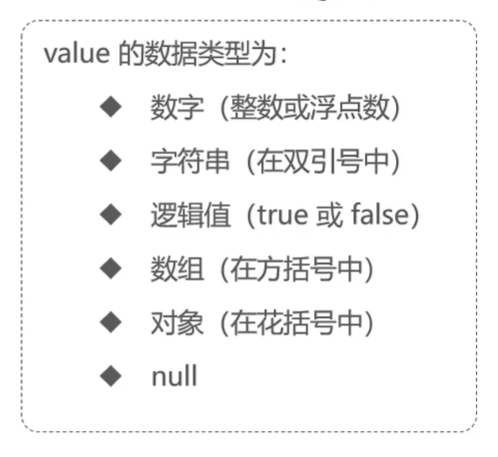
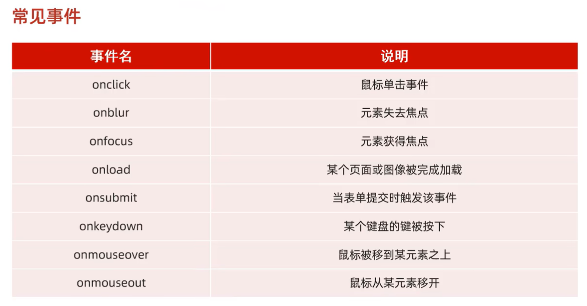

# JavaWeb_learn
记录本人JavaWeb学习过程

Web前端结构: HTML(结构)+CSS(表现)+JS(动作与交互)

1.HTML：超文本标记语言。
	
	-标签不区分大小写
	-属性值可用单引号和双引号
	-语法较为松散

img中src路径分为绝对路径/相对路径

	-绝对路径: 绝对磁盘路径/绝对网络路径(需要联网)。
	-相对路径: 相对于当前文件夹路径。
	
2.CSS引入方式:
	
	1.行内引入。只控制单个标签。
	2.内嵌引入。只控制本文件中标签，一般定义在head标签中。
	3.外联引入。在外部css文件中定义样式，由link引入。
	
在标签中可以添加id、class来分类标签，一般id值唯一，而class可以相同。

通过使用不同的选择器，指定修改的标签。优先级:id选择器 > 类选择器 > 元素选择器
	
	元素选择器: 元素{   }
	类选择器: .类名{   }
	id选择器: #id值{   }	
	
超链接:；可以通过css设置超链接样式。	

3.盒子模型:将页面内元素看成一个盒子，更好操作。相关标签
\

相关内容: content-padding-border-> margin外边距，不属于盒子。

	样式设计:
	        div {
            width: 200px; //盒子宽度
            height: 200px; //盒子高度
            box-sizing: border-box; //上述宽高作用的范围，当前是对border级别生效

            padding: 20px;//设置盒子的内边距区域
            border: 50px solid gold; //设置盒子的边框
            margin: 30px;  //设置外边界区域(盒子外部区域的上右下左)

        }
	
4.表格标签:

	<table border:表格边框  cellspacing:单元格的间隔  width:表格宽度> 
		<tr>//表行
			<th>表头单元格</th>
			
			<td>普通单元格</td>
			......
		</tr>
	</table>	
	
	
5.表单标签: form

	属性: action="数据提交到的URL"
	      method="提交数据的方式"
			get: 将表单数据接在url后，这样提交的数据长度(大小)有限制
			post: 将数据提交到post报文中，可以携带的数据量较大。
	
	表单项:
		input ：可以是输入框、单选、多选、时间列表、电子邮件、数字等等
			type: 控制输入的类型，如果是submit就会触发method提交数据
			name: 如果想要提交该项的内容，必须有name属性，用于标记返回的数据键值对：name1=value1&name2=value2
			value: 显示/提交的值	
		
		select:下拉列表
		textarea:文本域
	
6.JS：跨平台、面向对象的脚本语言；
脚本语言:不需要编译，由浏览器(解释器)直接解释。
	
	三种输出语句:
		    <!-- 方式1：弹窗警告 -->
    
    
    <!-- 方式2：输出在html页面 -->
     

    <!-- 方式3：输出在浏览器控制台 -->
     
	
变量:类似python，对变量赋值类型不做限制

		-var：作用域大，相当于全局变量，定义的变量可以跨{ }使用；并且var可以重复定义同名变量。
		-let：作用域小，类似于局部变量，无法跨{ }使用；
		-const：定义常量，该变量只能赋值一次，无法跨{ }使用。
	
	数据类型
		原始类型:number、string、boolean、null(空对象)、undefined(未初始化)；
		引用类型:对象
	
运算符:特殊的: ===：严格相等

	==：比较时先判断数据类型，类型不同则转换成相同的，然后再比较值。
	===:严格相等，当数据类型不同时直接返回false
	
类型转换:
	
	string->number: parseInt(s)/parseFloat(s)：返回s前面字符符合要求的数字，如果一位都没有，返回NaN
	其他类型-> boolean：0、NaN、空字符串""、null、undefined为false，其他为true
	
函数:
	
	定义方式:
		1.function functionName(参数1,参数2,......){
			函数体
		}
		
		2.var functionName = function(参数1,参数2,......){
			函数体
		}
		
		调用方式相同: functionName(参数1......)
		调用时传参可以传入不定参数，方法只会接收自己需要的前N个参数。
	
数组:类似Java中的集合，但比集合的限制更少
		
	1.长度可变。
	2.可以定义任意索引处的值，中间被跳过的索引处值为undefined。
	
	方法:forEach(方法):遍历有值的元素。
		 push(......)向数组末尾处添加元素。
		 splice(start, number)从指定索引处开始，删除number个元素。

箭头函数: (参数) => {方法体}	
	
字符串:与Java中类似。
		
	trim():去除开头与结尾的空格。
	s.indexOf("str"):该str在s中出现的首位索引。
	substring()、charAt()......
	
自定义对象:
	
	var user ={
            name: "Tom",
            age: 23,
            gender: "male",

			/*
			eat: function(){
                alert(user.name+"吃饭")
            } 
			*/
           eat(){
            alert(user.name+"正在吃饭")
           }
        }
		
        alert(user.name)
        user.eat()

JSON:本质上是一个字符串，格式与自定义对象类似，但key要使用双引号，最外层要使用单引号。
	
	var myJSON='{ "name": xxx, ......}'
	
	JSON.parse(JSON): 将json转换为对象；
	
	JSON.stringify(obj): 将对象转换为JSON；
	如果对象中有方法，则忽略方法。
	

BOM: 浏览器对象模型，由当前浏览器页面组成
    
    window对象:当前浏览器窗口对象。
        -属性history，location，navigator
        -方法
            1.alert:确认弹窗
            2.confirm:选择弹窗,返回false/true
            3.setInterval: 按照指定周期来调用函数
            4.setTimeout: 在指定毫秒数后调用某个函数。
        location：当前页面的导航栏
            location.href：获取/设置当前当前页面的url
            href=href，页面会进行跳转

DOM: 文件对象模型，将整个html页面视为document，标签为element
    
    1.每个标签有自己的属性和内容
    2.通过window.document.getBy[id | className | name | elementName]可以获取想要的标签
    3.对标签中的属性、内容进行处理。

事件监听: 给元素绑定一个事件，当事件触发是会执行相应的操作。

    绑定操作:
        1.在标签内部使用 事件名="函数名()"；
        2.在script中获取标签(元素)，通过元素.事件名= function(){
                                                        函数体
                                                        }
        
常见的事件:

	
Vue框架: view-model-viewmodel模型。
	
	1.需要先导入vue.js
	2.在script中创建Vue对象，
	  指定
		el:"#id", 该Vue对象实际控制的区域
		data: {......}, 该Vue的数据模型
		methods: { ...... }, 该Vue的函数模型
	3. 插值表达式：{{ }}
		
常用指令:
	
	v-bind:属性="data"(:属性="data"); 绑定标签的属性如href\css样式，这样就可以使用Vue中data部分的属性作为属性值，从而达到动态修改。
	v-model="data"; 在表单/input等上创建双向绑定，表单上被修改的数据实时映射到Vue的data对应数据中。
	v-on:事件="method"(@事件="method"); 为这个标签绑定事件。 
	
	v-if-else-if="condition":判断为true,则会在页面上渲染，否则不渲染。
	v-show="condition": 无论判断是否为true都会渲染，通过display来控制是否展示。
	v-for="(item, index) in items"; items为data中的数组，item为临时变量，index可有可无，为索引。
	
	
Vue的生命周期:一共有八个阶段。	
	
	
	
	
	
	
	
	
	
	
	
	
	
	
	
	
	
	